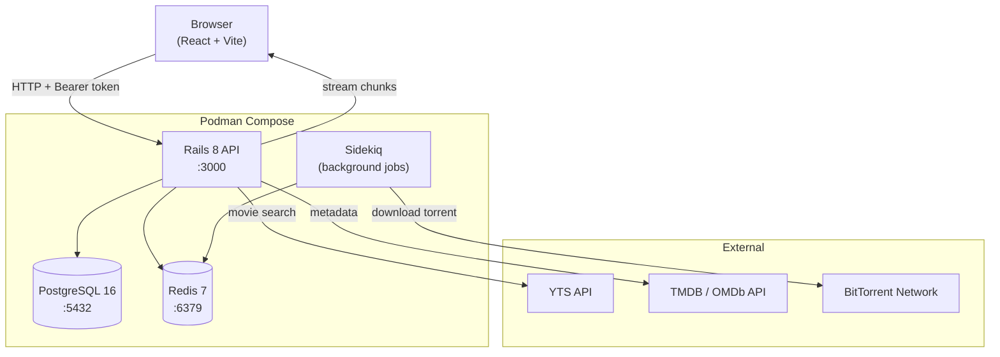
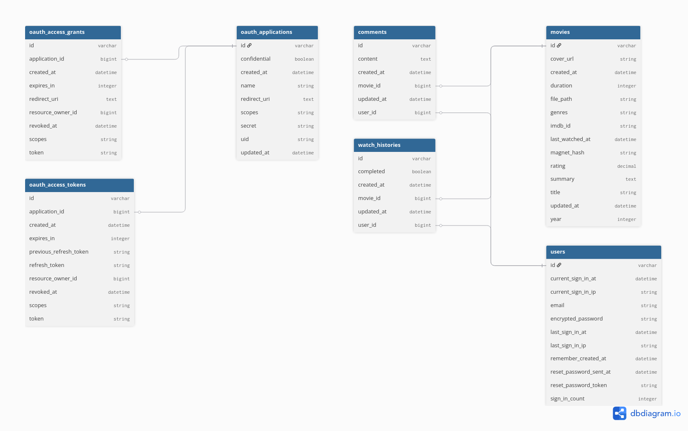

# Hypertube


> A web application to search, stream and watch videos via the BitTorrent protocol.  
> Videos are downloaded server-side and streamed directly to the browser player as data arrives.

---

## Architecture



---

## Database Schema



---

## Stack

| Layer       | Technology                                       |
|-------------|--------------------------------------------------|
| Frontend    | React 19, Vite, Bun, Axios                       |
| Backend     | Ruby 3.3, Rails 8.1 (API-only)                   |
| Auth        | Devise + devise-jwt, Doorkeeper (OAuth2)          |
| OmniAuth    | 42 Intra, Google                                 |
| Database    | PostgreSQL 16                                    |
| Cache/Jobs  | Redis 7, Sidekiq                                 |
| API Docs    | rswag (OpenAPI 3 · Swagger UI at `/api-docs`)    |
| Tests       | RSpec, FactoryBot, SimpleCov (HTML + LCOV)       |
| Runtime     | Podman + podman-compose                          |

---

## Quick Start

### 1 : Clone and configure

```bash
git clone <repo-url> hypertube && cd hypertube

cp api/.env.example api/.env.local   # fill in DB creds, OAuth keys, secrets
cp web/.env.example web/.env.local   # fill in VITE_API_URL
```

### 2 : Bootstrap the backend (first run only)

```bash
make build     # build image
make up        # start PostgreSQL + Redis + Rails
make migrate   # run migrations
```

### 3 : Start the frontend

```bash
cd web
bun install
bun dev        # http://localhost:5173
```

API interactive docs → **http://localhost:3000/api-docs**

---

## Make Targets

| Target              | Description                                     |
|---------------------|-------------------------------------------------|
| `make build`         | First-time full bootstrap                       |
| `make up`           | Start all services in the background            |
| `make down`         | Stop all services                               |
| `make bash`         | Open a shell inside the backend container       |
| `make console`      | Rails console                                   |
| `make migrate`      | Run pending migrations                          |
| `make rollback`     | Roll back the last migration                    |
| `make routes`       | Print all Rails routes                          |
| `make test`         | Run the full RSpec suite                        |
| `make coverage`     | RSpec + SimpleCov HTML report (`api/coverage/`) |
| `make seed`         | Seed the database                               |
| `make generate g=X` | `bundle exec rails generate X`                  |
| `make db-reset`     | Drop → create → migrate → seed                 |
| `make setup-front`  | `bun install` inside `web/`                     |

---

## API Endpoints (summary)

| Method   | Path                              | Auth     | Description                    |
|----------|-----------------------------------|----------|--------------------------------|
| `POST`   | `/oauth/token`                    | Public   | Obtain access token            |
| `GET`    | `/api/v1/users`                   | Bearer   | List users                     |
| `GET`    | `/api/v1/users/:id`               | Bearer   | User profile                   |
| `PATCH`  | `/api/v1/users/:id`               | Bearer   | Update own profile             |
| `GET`    | `/api/v1/movies`                  | Public   | Top movies                     |
| `GET`    | `/api/v1/movies/:id`              | Bearer   | Movie details                  |
| `GET`    | `/api/v1/comments`                | Bearer   | Latest comments                |
| `POST`   | `/api/v1/movies/:id/comments`     | Bearer   | Post a comment                 |
| `PATCH`  | `/api/v1/comments/:id`            | Bearer   | Edit own comment               |
| `DELETE` | `/api/v1/comments/:id`            | Bearer   | Delete own comment             |

See `/api-docs` for the full OpenAPI spec.

---

## Project Structure

```
hypertube/
├── api/                        # Rails 8 API backend
│   ├── app/
│   │   ├── controllers/api/v1/
│   │   ├── models/
│   │   └── jobs/
│   ├── spec/                   # RSpec + rswag request specs
│   ├── swagger/v1/swagger.yaml # Generated OpenAPI spec
│   ├── Dockerfile.dev
│   └── Dockerfile
├── web/                        # React + Vite frontend
│   └── src/
│       ├── api/                # Axios client
│       └── components/
├── docs/
│   └── db_schema.png           # ← add generated schema image here
├── docker-compose.yml
└── Makefile
```
